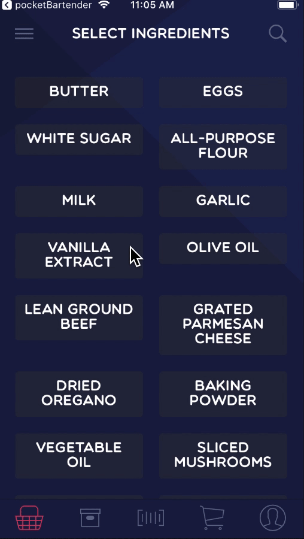

# peckish
A React-Native app that helps you find recipes you can make using what you already have in your pantry!

# Implemented Features

| Description | Animation |
| --- | --- |
| Easily find ingredients you have in your pantry, by searching, or by sorting by alphabetically, type, or how often that ingredient shows up in recipes! |  | 
| Select ingredients you have in your pantry and suggest recipes that you can make with those ingredients! The returned recipes are automatically sorted by fewest missing ingredients. | |
| Easily browse recipes and find one that suits your liking. Add personal notes if you made the recipe before! | |
| Create intelligent grocery lists that add your missing ingredients and custom items. | |
| Scan barcodes of products to automatically add them to your pantry. | (Not shown due to lack of camera on iphone simulator)|
| Log in with Google or Facebook to automatically save your pantry | *Still in development* |
| Favorite recipes for later! | *Still in development* |
| Upload your own custom recipes | *Still in development* |
| Syncronize grocery list with family members! | *Still in development* |

## Useage
This app was created in Expo for it's rapid prototyping capabilities, so make sure you have that. Unfortunately, the file server is not running anymore, so if you compile the app, you won't be able to see any ingredients or recipes. :(

## Credits
This app was created as the final project for Mobile Computing Applications (MCA) at St. Olaf College, Interim 2018.

**Authors:**  
Andreas Raduege ([@Eldjotnar](https://github.com/Eldjotnar/))  *Front-End and UI*  
Hugo Valent ([@HugoHugo](https://github.com/HugoHugo/))        *Java File Server*  
Soma Beleznay ([@SBelez](https://github.com/SBelez))           *Database Management*  
Brendan Ireland ([@irelan1](https://github.com/irelan1))       *Recipe Webcrawler*  
